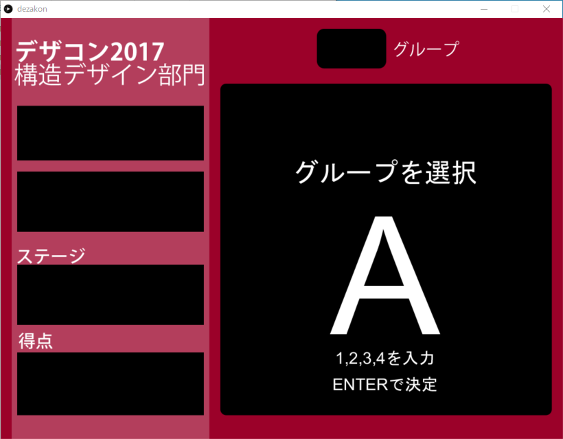
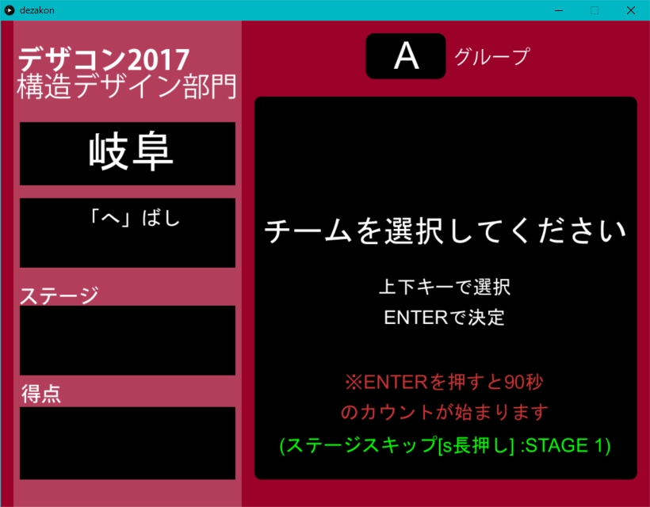
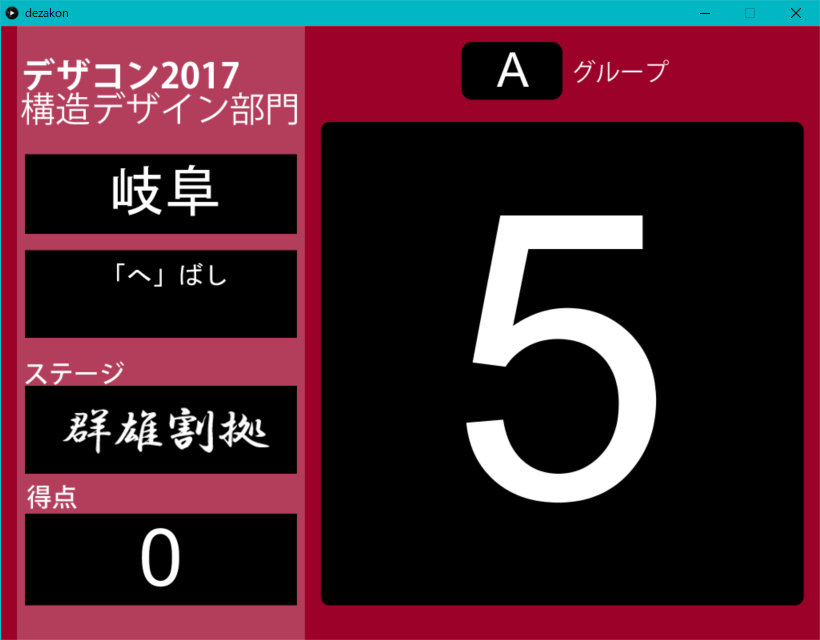
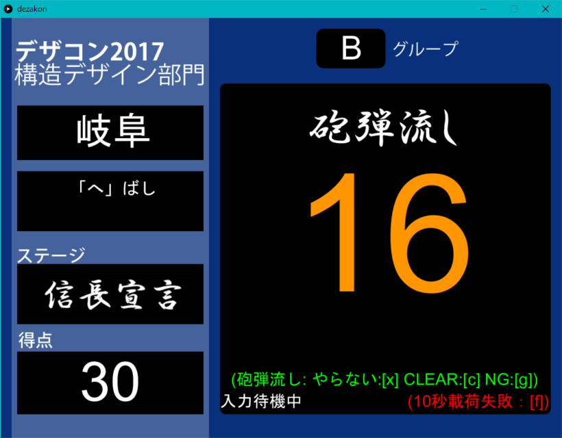
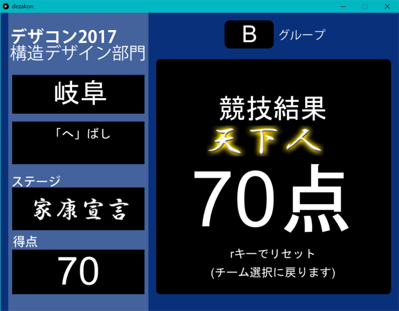

# Dezacon2017_CountUp
2017年12月3日、「デザコン2017 in 清流の国ぎふ」の構造デザイン部門において、競技補助用として使用されたカウントアップツールです  

## 概要
このツールは、構造デザイン部門の耐荷試験において10秒間のカウントをより視覚的にわかりやすく、かつステージの進行や、得点などをより分かりやすくするために制作したものです。今年のルールブックに則り、ステージの進行、得点の増減などを確認することが出来ます。ルールなど詳細はデザコンのホームページをご覧ください。 
  
## 機能・入力方法
### 1. グループ・チーム選択
  
キーボードの「1,2,3,4」キーのどれかを押すと、画面上に数字に対応した「A,B,C,D」の文字が表示され、グループ（読み込むテキストファイル）を選択します。    
  
  
次にテキストファイルから読み込まれたチームリストの中から、競技を開始するチームを「上下」キーで選択します。  
  
### 2. 10秒耐荷カウント
  
準備時間をとったあと、10秒の耐荷試験のカウントが始まります。この時間内に、「f」キーを押すことで失敗判定、「ｒ」キーを長押しすることでカウントを始める前まで戻ることが出来ます。  

### 3. 砲弾流し・宣言選択
  
10秒の耐荷カウントの後、砲弾流しと宣言を30秒以内にします。この時、砲弾流しの結果を画面に従い入力し、宣言の選択を入力します。選択後、得点と宣言の表示が変化します。  

### 4. 最終結果表示
  
失格、宣言をしない、砲弾流しをしない、天下人まで到達した時点で、この最終結果画面が表示されます。「r」キーを押すことで、チーム選択画面まで戻ります。  

## 使用言語・開発期間
- 使用言語：Processing  
- 開発期間：10日（？）

## 感想
正直、このプログラムはProcessingで制作したため、そこまで大したものでもありません。ただテキストを表示し、画像を表示し...、の繰り返しです。ですが、元々私はプログラムを書く人ではないので、どうやったら使いやすくなるかなど、少し勉強になったかなと思います。（もう一生こんな依頼やらない...。

